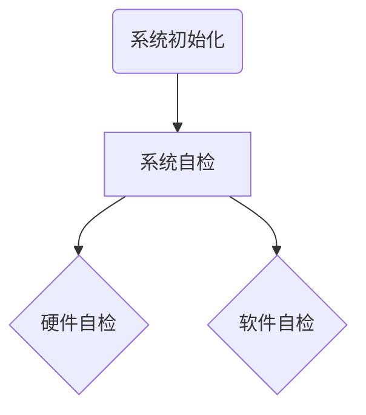

# 程序设计

## 整体流程

待机模式 → 人脸检测唤醒 → 情绪连续识别 → 确认情绪类型 → 执行对应反馈 → 动态调整反馈（根据持续时间） → 无人脸回归待机

## 情绪识别逻辑

- 识别情绪类型：
- 确认机制：
- 识别失败处理：

## 不同情绪对应的指令

1. 台灯
- 开心：
- 伤心：
- 平静：
- 专注：

## 程序逻辑流程图

```mermaid
graph TD;
START(系统初始化) --> SELFCHECK[系统自检];
SELFCHECK --> HARDWARE{硬件自检};
SELFCHECK --> SOFTWARE{软件自检};

```